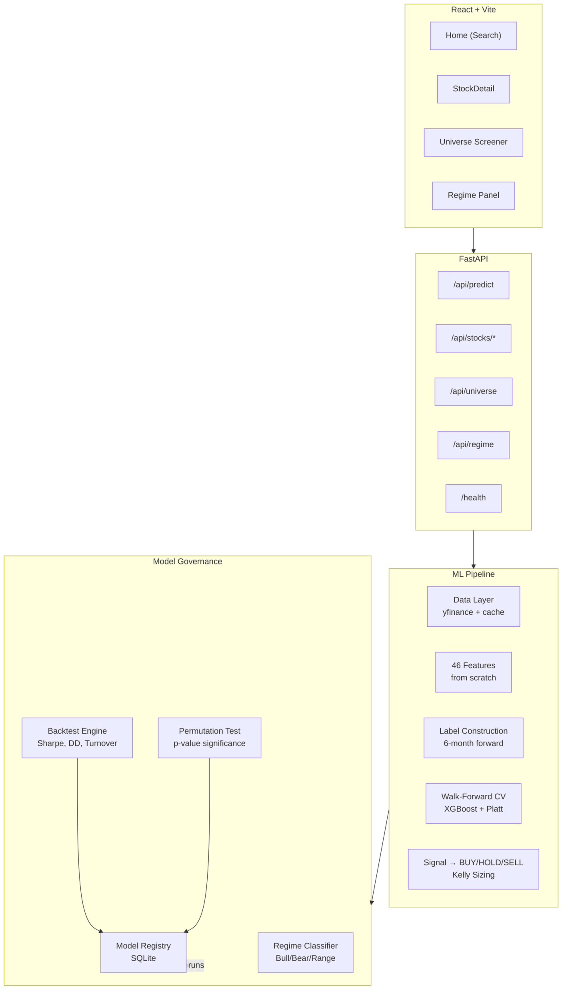
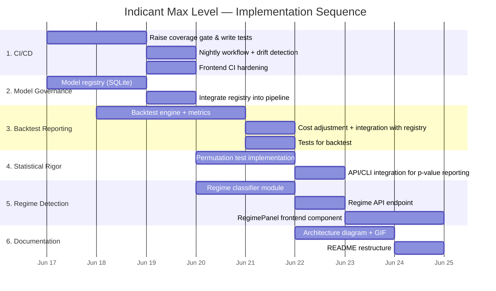

# Indicant — Max Level Implementation Plan

**Status: Draft** · **Version: 0.1** · **Date: 2026-06-17**

This plan covers six improvement areas that take Indicant from "works on my machine" to "I can hand this to an interviewer and get a nod." Each area is self-contained with its own files, tests, and acceptance criteria. Ordering is intentional — earlier items pay for later ones.

---

## Table of Contents

1. [CI/CD That Matters](#1-cicd-that-matters)
2. [Model Governance](#2-model-governance)
3. [Honest Backtest Reporting](#3-honest-backtest-reporting)
4. [Statistical Rigor (Permutation Test)](#4-statistical-rigor-permutation-test)
5. [Regime Detection (Promote from Backlog)](#5-regime-detection-promote-from-backlog)
6. [Architecture Diagram + README GIF/Demo](#6-architecture-diagram--readme-gifdemo)
7. [Dependencies & Sequencing](#7-dependencies--sequencing)
8. [Risk Register](#8-risk-register)

---

## 1. CI/CD That Matters

### Goal
- Every PR runs the full `pytest --cov` gate.
- Merge is **blocked** below coverage threshold (raise to 60% → eventually 70%).
- A scheduled nightly workflow re-runs the pipeline on **fresh market data** to catch silent drift in indicator math.
- All three badges (CI, coverage, last-nightly) are visible on the README.

### Files to Create/Modify

| File | Action | Purpose |
|------|--------|---------|
| `.github/workflows/ci.yml` | Modify | Add coverage gate: `--cov-fail-under=60`, upload coverage artifact |
| `.github/workflows/nightly.yml` | Create | Scheduled run (cron `0 6 * * 1-5`), full pipeline with fresh yfinance data, matrix across NIFTY 50 |
| `.github/workflows/frontend.yml` | Modify | Add ESLint fail on warnings (remove `continue-on-error`) |
| `backend/pyproject.toml` | Modify | Bump `--cov-fail-under` from 40 → 60 |
| `README.md` | Modify | Add nightly CI badge, scheduled check badge |

### Detailed Plan

#### 1a. Raise Coverage Gate (pyproject.toml)
```
Current: --cov-fail-under=40
Target:  --cov-fail-under=60
```

This requires either writing more tests or excluding more modules from coverage. Strategy:
- **Write tests** for uncovered modules first (gradient_boost, signal generator edge cases, preprocessor edge cases)
- **Exclude** `pipeline.py` (CLI) and `gradient_boost.py` (already excluded) — but `gradient_boost.py` is core logic and should have tests, not exclusion
- New tests will be written as part of the backtest and permutation test sections below

#### 1b. CI: Strict Coverage Gate (ci.yml)
Add after the test run step:
```yaml
- name: Check coverage threshold
  run: |
    coverage report
    coverage xml
- name: Upload coverage artifact
  uses: actions/upload-artifact@v4
  with:
    name: coverage-report
    path: backend/coverage.xml
    retention-days: 30
```

Add a **status check** in GitHub repo settings requiring `lint-and-test` to pass. Document this in `.github/CONTRIBUTING.md` or the README.

#### 1c. Nightly Repro Validation (nightly.yml)
```yaml
name: Nightly Repro

on:
  schedule:
    - cron: '0 6 * * 1-5'   # 6 AM UTC, Mon-Fri (during market hours)
  workflow_dispatch:          # manual trigger for debugging

jobs:
  validate:
    runs-on: ubuntu-latest
    strategy:
      matrix:
        index: [NIFTY50, NIFTY100]
    steps:
      - checkout + setup python
      - pip install -e ".[dev]"
      - name: Run full ML pipeline on fresh data
        run: |
          python -c "
          from market_regime.pipeline import run_single;
          result = run_single('RELIANCE.NS', horizon_months=6);
          print(f'Signal: {result.signal}, Confidence: {result.confidence}');
          "
      - name: Screener smoke test
        run: indicant screen --index ${{ matrix.index }} --horizon 6 --top 5
      - name: Compare indicator values to previous run (baseline)
        run: python scripts/check_indicator_drift.py
      - name: Notify on failure
        uses: slackapi/slack-github-action@v1  # or email
```

A companion script `scripts/check_indicator_drift.py` (new) that caches the last N indicator outputs and flags any that deviate beyond a tolerance — catches changes in yfinance output, upstream API breakage, or silent math bugs.

#### 1d. Frontend CI Hardening (frontend.yml)
- Remove `continue-on-error: true` from the lint step so lint failures block
- Add `--strict` to the TypeScript build check (if any TS is used) — currently JSX, so add ESLint strict config

---

## 2. Model Governance

### Goal
Every training run logs its hyperparameters, OOS Sharpe, data date range, and feature set to a versioned registry. This enables:
- Reproducing any past prediction
- Comparing runs across time
- Answering "what changed between run A and run B?"
- Rolling back to a known-good model

### Files to Create/Modify

| File | Action | Purpose |
|------|--------|---------|
| `backend/market_regime/registry/__init__.py` | Create | Package init |
| `backend/market_regime/registry/model_registry.py` | Create | SQLite-based model registry (no MLflow dependency) |
| `backend/market_regime/registry/schema.sql` | Create | DDL for the registry table |
| `backend/market_regime/models/gradient_boost.py` | Modify | Log after fit() completes |
| `backend/market_regime/pipeline.py` | Modify | Log after training, accept optional registry flag |
| `backend/market_regime/api/routes/prediction.py` | Modify | Optionally log API-prediction runs |
| `backend/pyproject.toml` | Modify | Add `sqlite3` to deps (stdlib — no change needed) |

### Design Decisions

**Why SQLite, not MLflow?** MLflow is already a dependency but its tracking URI is Docker-volume-only, making ad-hoc queries harder. A local SQLite file (`model_registry.db`) co-located with the codebase is:
- Queryable with standard SQL
- Portable (single file)
- Simple to diff across git branches
- No server to run

The MLflow dependency can be removed later since this replaces its primary use case.

**Schema:**

```sql
CREATE TABLE IF NOT EXISTS training_runs (
    run_id          TEXT PRIMARY KEY,
    ticker          TEXT NOT NULL,
    model_type      TEXT NOT NULL,       -- 'gradient_boost', 'logistic'
    created_at      TEXT NOT NULL,       -- ISO 8601

    -- Data
    data_start      TEXT NOT NULL,       -- date of earliest training sample
    data_end        TEXT NOT NULL,       -- date of latest training sample
    n_samples       INTEGER NOT NULL,
    n_features      INTEGER NOT NULL,
    horizon_days    INTEGER NOT NULL,
    label_threshold REAL NOT NULL,

    -- Hyperparameters (JSON blob for flexibility)
    hyperparams     TEXT NOT NULL,       -- JSON

    -- Performance (populated after backtest)
    oos_sharpe      REAL,               -- out-of-sample Sharpe ratio
    oos_sortino     REAL,
    oos_max_dd      REAL,               -- max drawdown
    oos_turnover    REAL,               -- annualised turnover
    cost_adjusted_sharpe REAL,          -- Sharpe after transaction costs

    -- Validation
    accuracy        REAL,
    precision       REAL,
    recall          REAL,

    -- Artifact
    model_artifact  TEXT,               -- relative path to saved model file
    feature_list    TEXT NOT NULL,       -- JSON array of feature names

    -- Status
    status          TEXT DEFAULT 'trained'  -- 'trained', 'evaluated', 'deployed', 'archived'
);
```

### API

```python
class ModelRegistry:
    def __init__(self, db_path: str = "model_registry.db")
    def create_tables(self)                          # DDL
    def log_run(self, run_data: dict) -> str         # returns run_id
    def update_run(self, run_id: str, updates: dict) # add backtest results
    def get_run(self, run_id: str) -> dict
    def list_runs(self, ticker: str = None, limit: int = 20) -> list[dict]
    def get_best_run(self, ticker: str, metric: str = "oos_sharpe") -> dict
```

### Integration Points

**In `GradientBoostModel.fit()`**: After training completes, call `registry.log_run()` with current params. Store the run_id on the model instance.

**In `run_single()` (pipeline.py)**: After prediction, call `registry.log_run()` if a flag is set. The prediction route in the API can optionally log runs.

**Model persistence**: Use `joblib.dump()` (stdlib + sklearn compatible) to save the trained model to `artifacts/{run_id}.joblib`. The path goes into `model_artifact`.

---

## 3. Honest Backtest Reporting

### Goal
The current pipeline predicts one point. We need a proper **walk-forward backtest** that reports:

| Metric | Why It Matters |
|--------|----------------|
| **Max Drawdown** | "What's the worst it would have looked?" |
| **Sortino Ratio** | "Only penalises downside volatility — more honest for non-normal returns" |
| **Annualised Turnover** | "How often would I have traded?" (directly → costs) |
| **Transaction-Cost-Adjusted Sharpe** | "After 0.1% per trade (Indian STT + brokerage), is it still positive?" |
| **Headline Sharpe** | For comparison, but with all the caveats noted |

### Files to Create/Modify

| File | Action | Purpose |
|------|--------|---------|
| `backend/market_regime/backtest/__init__.py` | Create | Package init |
| `backend/market_regime/backtest/engine.py` | Create | Walk-forward backtest engine |
| `backend/market_regime/backtest/metrics.py` | Create | Sharpe, Sortino, max DD, turnover, cost adjustment |
| `backend/market_regime/validation/walk_forward.py` | Modify | Return predictions alongside splits (or create a higher-level orchestrator) |
| `backend/tests/test_backtest.py` | Create | Tests for backtest engine + metrics |
| `backend/pyproject.toml` | Modify | Ensure deps include `scipy` (already there) |

### Backtest Engine Design

```python
@dataclass
class BacktestConfig:
    ticker: str
    horizon_months: int = 6
    model_type: str = "gradient_boost"
    transaction_cost: float = 0.001          # 0.1% per trade (STT + brokerage)
    slippage: float = 0.0005                # 0.05% slippage
    kelly_multiplier: float = 0.5           # half-Kelly
    max_position: float = 0.10              # 10% per stock
    initial_capital: float = 1_000_000      # ₹10L

@dataclass
class BacktestResult:
    ticker: str
    total_return: float                     # % return over backtest period
    cagr: float                             # annualised return
    volatility: float                       # annualised vol of strategy returns
    sharpe_ratio: float                     # risk-free = 0 (standard for quant)
    sortino_ratio: float                    # downside deviation only
    max_drawdown: float                     # peak-to-trough, as % (negative)
    max_drawdown_duration: int              # days to recover
    annualised_turnover: float              # fraction of portfolio traded per year
    cost_adjusted_sharpe: float             # Sharpe after costs
    n_trades: int
    win_rate: float                         # fraction of profitable trades
    monthly_returns: list[float]            # for equity curve
    year_by_year: dict[str, float]          # e.g. {"2024": 12.3, "2025": -2.1}
```

### Backtest Loop

For each walk-forward fold:
1. Train model on train fold
2. Predict on test fold (every day, not just end — get a prediction for each test row)
3. Generate signal from prediction probability (BUY/HOLD/SELL)
4. Size position via Kelly (or no position on HOLD)
5. Record daily PnL: position_size × daily_return - transaction_cost on signal change
6. Accumulate into portfolio equity curve

After all folds:
1. Compute metrics from the full equity curve
2. Log everything to the model registry (Section 2)

### Metrics Implementations

```python
def sharpe_ratio(daily_returns: np.ndarray, risk_free: float = 0.0) -> float:
    """Annualised Sharpe = mean(excess_return) / std(return) * sqrt(252)"""

def sortino_ratio(daily_returns: np.ndarray, risk_free: float = 0.0) -> float:
    """Sortino = mean(excess_return) / downside_std * sqrt(252)
       downside_std = std of negative returns only"""

def max_drawdown(equity_curve: np.ndarray) -> tuple[float, int]:
    """Peak-to-trough drawdown and its duration in days.
       Returns (drawdown_pct, recovery_days)"""

def annualised_turnover(trades: list, total_days: int) -> float:
    """Sum of absolute position changes per year / average portfolio value"""

def cost_adjusted_sharpe(raw_sharpe: float, turnover: float, cost_per_trade: float) -> float:
    """Approximate: adjusted_return = raw_return - turnover * cost_per_trade
       Then recompute Sharpe with adjusted return mean."""
```

### Integration with Registry

After the backtest completes, call `registry.update_run(run_id, backtest_metrics)`. This links every trained model to its honest backtest results.

### Tests

- Synthetic price series with known properties → verify each metric formula
- Test that cost_adjusted_sharpe < raw_sharpe (trivial but catches sign errors)
- Test max_drawdown on a known sawtooth equity curve
- Test turnover calculation on a sequence of trades

---

## 4. Statistical Rigor (Permutation Test)

### Goal
The single most important statistical addition: answer the question **"Could this Sharpe ratio have happened by chance with randomly shuffled labels?"**

A permutation test:
1. Train the model on real data → get real Sharpe
2. Shuffle labels (break any signal) → train → get null Sharpe
3. Repeat N times (1000+) → build null distribution
4. Compute p-value = fraction of null Sharpe >= real Sharpe
5. Report: "Strategy Sharpe = 0.93, p < 0.01 (99% confidence not random)"

This separates "I backtested it" from "I know backtests lie."

### Files to Create/Modify

| File | Action | Purpose |
|------|--------|---------|
| `backend/market_regime/backtest/permutation_test.py` | Create | Permutation + Monte Carlo testing |
| `backend/tests/test_permutation.py` | Create | Unit tests for permutation logic |
| `backend/pyproject.toml` | No change needed | Already has numpy, scipy |

### Design

```python
@dataclass
class PermutationTestResult:
    real_sharpe: float
    null_sharpe_distribution: list[float]
    p_value: float               # fraction of null >= real
    n_permutations: int
    significant: bool            # p_value < 0.05
    interpretation: str          # human-readable summary

def permutation_test(
    X: pd.DataFrame,
    y: pd.Series,
    backtest_fn: Callable,       # the walk-forward backtest
    n_permutations: int = 1000,
    random_seed: int = 42,
) -> PermutationTestResult:
    """
    1. Compute real Sharpe via backtest_fn(X, y)
    2. For i in 1..n_permutations:
       a. Shuffle labels: y_shuffled = y.sample(frac=1)
       b. Compute null Sharpe: backtest_fn(X, y_shuffled)
    3. p_value = (count(null_sharpe >= real_sharpe) + 1) / (n_permutations + 1)
       (+1 for the real test itself, per Davison & Hinkley)
    """
```

### Important Considerations

- **Label shuffling MUST happen AFTER the train/test split**, not before. Shuffling globally can introduce data leakage. The correct approach: shuffle the labels *within each train fold* before fitting.
- The null distribution will often be centered near zero (no edge expected from random labels). If it's systematically positive or negative, there's a structural bias in the backtest.
- 1000 permutations takes time. Add a progress bar + caching: store results in the model registry so they're computed once per run.

### Statistical Reporting

Add to the API response (optional flag) and CLI output:
```
Backtest Results for RELIANCE.NS:
──────────────────────────────────
Sharpe Ratio:                  0.93
Sortino Ratio:                 1.21
Max Drawdown:                 -18.4%
Annualised Turnover:           2.3x
Cost-Adjusted Sharpe (0.1%):   0.81
Permutation Test (1000 runs):
  p-value:                     0.003
  Interpretation:              Strategy outperforms 99.7% of random label shuffles
  ⭐ Statistically significant at 1% level
```

### Tests

- Synthetic data with known signal → permutation test should find significance
- Random data (no signal) → permutation test should NOT find significance
- P-value boundary case: perfect separation should give p ≈ 1/(N+1)

---

## 5. Regime Detection (Promote from Backlog)

### Goal
The existing regime features (ADX, trend consistency, drawdown) are *features for the ML model*. The user wants regime detection as a **standalone module** that:
- Classifies the current market into regimes: Bull, Bear, Range-bound, High Volatility, Low Volatility
- Produces a regime signal that the prediction page can display
- Ties narratively to `ai_trade` without implementing AI trading

### Current State
- `add_regime_features()` in `technical.py` computes ADX, +DI/-DI, trend consistency, drawdown, 52-week position
- These are used as features for the ML model
- No standalone regime classification exists

### New Module: `market_regime/regime/`

| File | Action | Purpose |
|------|--------|---------|
| `backend/market_regime/regime/__init__.py` | Create | Package init |
| `backend/market_regime/regime/classifier.py` | Create | Heuristic + simple ML regime classifier |
| `backend/market_regime/regime/visualizer.py` | Create | Generate regime regime chart for frontend |
| `backend/tests/test_regime.py` | Create | Tests for regime classification |
| `backend/market_regime/api/routes/regime.py` | Create | `GET /api/regime/{ticker}` endpoint |
| `backend/market_regime/api/schemas.py` | Modify | Add `RegimeResponse` schema |
| `backend/market_regime/api/main.py` | Modify | Register regime router |
| `frontend/src/components/RegimePanel.jsx` | Create | UI component for regime display |
| `frontend/src/api/client.js` | Modify | Add regime endpoint |
| `frontend/src/pages/StockDetail.jsx` | Modify | Display regime panel |

### Regime Classification Logic

**Heuristic approach (Phase 1):**

```python
@dataclass
class RegimeResult:
    ticker: str
    primary_regime: str            # "Bull", "Bear", "RangeBound", "HighVol", "LowVol"
    regime_score: float            # confidence in classification, 0..1
    adx: float
    trend_direction: str           # "up", "down", "sideways"
    volatility_regime: str         # "low", "normal", "high"
    drawdown_regime: str           # "peak", "normal", "correction", "bear"
    composite_signal: str          # "risk_on", "risk_off", "neutral"
    regime_history: list[dict]     # last 252 days of regime labels for visualisation
```

Classification rules (from the existing features):

```
if ADX < 20:
    regime = "RangeBound"
elif ADX >= 20 and plus_di > minus_di:
    regime = "Bull"       # Trending up
elif ADX >= 20 and minus_di > plus_di:
    regime = "Bear"       # Trending down

if rv_63 > rolling_80th_percentile(rv_63, 252):
    volatility_regime = "high"
elif rv_63 < rolling_20th_percentile(rv_63, 252):
    volatility_regime = "low"
else:
    volatility_regime = "normal"

if drawdown > -0.05:
    drawdown_regime = "peak"
elif drawdown > -0.15:
    drawdown_regime = "normal"
elif drawdown > -0.30:
    drawdown_regime = "correction"
else:
    drawdown_regime = "bear"
```

### API

```python
# GET /api/regime/RELIANCE.NS
Response:
{
  "ticker": "RELIANCE.NS",
  "analysis_date": "2026-06-17",
  "primary_regime": "Bull",
  "regime_confidence": 0.82,
  "trend_direction": "up",
  "volatility_regime": "normal",
  "drawdown_regime": "peak",
  "adx": 28.5,
  "composite_signal": "risk_on",
  "regime_history": [
    {"date": "2025-06-17", "regime": "Bull"},
    {"date": "2025-07-01", "regime": "RangeBound"},
    ...
  ]
}
```

### Frontend: RegimePanel.jsx

A small card component showing:
- Regime badge (coloured: green=Bull, red=Bear, yellow=RangeBound, orange=HighVol, blue=LowVol)
- Trend arrow (↑/↓/→)
- ADX gauge (0-100)
- Drawdown indicator bar
- Composite signal badge (risk_on/risk_off/neutral)
- Regime history sparkline (coloured bar chart over time)

### Backend Tests

- Test classification on known market regimes
- Test that ADX < 20 always gives RangeBound
- Test volatility regime percentile logic
- Test API integration

---

## 6. Architecture Diagram + README GIF/Demo

### Goal
A 60-second visual that tells a recruiter everything they need to know. Not a wall of text.

### Files to Create/Modify

| File | Action | Purpose |
|------|--------|---------|
| `README.md` | Modify | Replace ASCII art with Mermaid diagram, add demo GIF |
| `docs/architecture.md` | Create | Detailed architecture doc |
| `docs/assets/architecture.png` | Create | Rendered arch diagram |
| `docs/assets/demo.gif` | Create | Terminal + browser demo recording |
| `scripts/generate_diagram.py` | Create | Script to render architecture diagram |
| `scripts/record_demo.sh` | Create | Script to record demo GIF |

### Architecture Diagram

Replace the current ASCII diagram with a Mermaid diagram that renders on GitHub:



### Demo GIF

A 60-second recording showing:

1. **CLI demo (0-20s):** `indicant predict RELIANCE` → shows signal, confidence, top features
2. **Web demo (20-40s):** Browser → type ticker → see prediction card + indicators + regime panel
3. **Backtest (40-60s):** `indicant backtest RELIANCE --show-metrics` → shows Sharpe, Sortino, drawdown, permutation test result

Use `vhs` (from Charmbracelet) or `asciinema` + `agg` for terminal recording, and `gifski` for combining with browser screenshots.

### README Restructuring

Current README is 408 lines — excellent content but too long for scanning. Restructure:

```
README.md (new structure):
├── Header (badges + one-liner)
├── Demo GIF (visual first!)
├── What it does (3 sentences)
├── Quick Start (docker-compose up)
├── Architecture (Mermaid diagram)
├── ML Design (link to docs/ml-design.md)
├── Key Results (latest backtest stats)
├── Project Structure (tree, collapsed)
├── Tech Stack (table)
└── Author
```

Move the detailed ML design to `docs/ml-design.md` and link to it. Keep the README scannable.

---

## 7. Dependencies & Sequencing



### Parallelisation Opportunities

- **Week 1 (Days 1-3):**
  - Track A: CI/CD + model registry (can run in parallel)
  - Track B: Backtest engine (independent of A)
  - **Merge** registry + backtest when both done

- **Week 1 (Days 3-5):**
  - Track A: Permutation test (depends on backtest metrics)
  - Track B: Regime detection module (independent)
  - Track C: Frontend regime panel (depends on regime API)

- **Week 2 (Days 5-7):**
  - Documentation & polishing
  - Integration testing across all modules

---

## 8. Risk Register

| # | Risk | Impact | Likelihood | Mitigation |
|---|------|--------|------------|------------|
| 1 | Coverage gate blocks all PRs while tests are insufficient | High | High | Set initial threshold at current coverage, then raise incrementally |
| 2 | Nightly runs fail due to yfinance API changes | Medium | Medium | The drift detection script alerts instead of blocking |
| 3 | Permutation test takes too long (1000 runs × 2min = 33hrs) | Medium | High | Cache results; use fewer permutations (200) in CI, full 1000 on-demand |
| 4 | Regime classification rules overfit to recent market | Medium | Low | Validate against multiple market periods (2020 crash, 2021 bull, 2022 correction) |
| 5 | Backtest shows strategy is not profitable after costs | Low (for the plan) | Medium | That's the point — honest reporting is the goal. No mitigation needed. |
| 6 | SQLite registry doesn't scale with universe screening | Low | Low | Single-file DB is fine for individual stock runs. Universe screening doesn't log every run by default. |

---

## Critical Revision: Permutation Test Timing Risk

After review: **Risk #3 is understated.** A full walk-forward with XGBoost retraining per fold could take 5–15 seconds per run. At 1000 permutations, that's 1.4–4 hours *per ticker* — even 200 runs is 20–50 minutes. If the backtest runs across the NIFTY 50 universe, this balloons to days.

### Mitigation Strategy

**Do a timing test on Day 1**, before committing the permutation test design:

```python
# scripts/benchmark_permutation.py
# Train one model, measure end-to-end time for a single
# walk-forward + backtest iteration on RELIANCE.NS.
# Extrapolate: time × n_permutations = total cost.
```

Then choose one of:

| Option | Trade-off |
|--------|-----------|
| **A. Single model, reduced permutations** — Run 200 permutations against XGBoost only (not the full ensemble). Falls back in < 1 hour per stock. | Methodologically defensible if you state "permutation test run against XGBoost primary model; ensemble not included for tractability." |
| **B. Pre-compute + cache** — Run the permutation test once per ticker/horizon combo; cache results in the registry. Subsequent runs just read from cache. | Accepts the one-time cost; makes daily CI/pipeline use free. |
| **C. Subsampled walk-forward** — Instead of full walk-forward (5+ folds), run a single train/test split for the permutation test. Faster but less realistic. | Weaker statistical case; only appropriate as a rough check. |

**Recommendation**: Option A (200 permutations, single model) for the API/CLI, with Option B (cached after first run) for production use. Verify with the timing test on Day 1 before planning the schedule around it.

## Implementation Order Recommendation

**Sequential, not parallel** — for a solo dev, context-switching across tracks is the real cost.

1. **Model registry** (Days 1–2) — everything downstream depends on it
2. **Timing benchmark** (Day 2 AM) — measure permutation test cost before committing design
3. **Backtest engine** (Days 2–4) — builds on registry, enables honest metrics
4. **CI/CD + coverage** (Days 3–5, overlaps with backtest) — incremental improvements; doesn't block anything
5. **Permutation test** (Days 5–7) — depends on backtest metrics; design finalised after timing benchmark
6. **Regime detection** (Days 6–9, some overlap with 5) — independent module after registry is done
7. **Documentation** (Days 9–10) — polish at the end

**Total estimated effort: 10–15 days of focused implementation** (realistic for a solo dev).

**If this is alongside other commitments**: Budget 3–4 calendar weeks. Each section can be resumed with minimal context loss because the registry ties everything together and the plan document is the single source of truth.

---

*This plan is a living document — update it as implementation reveals edge cases or better approaches.*
