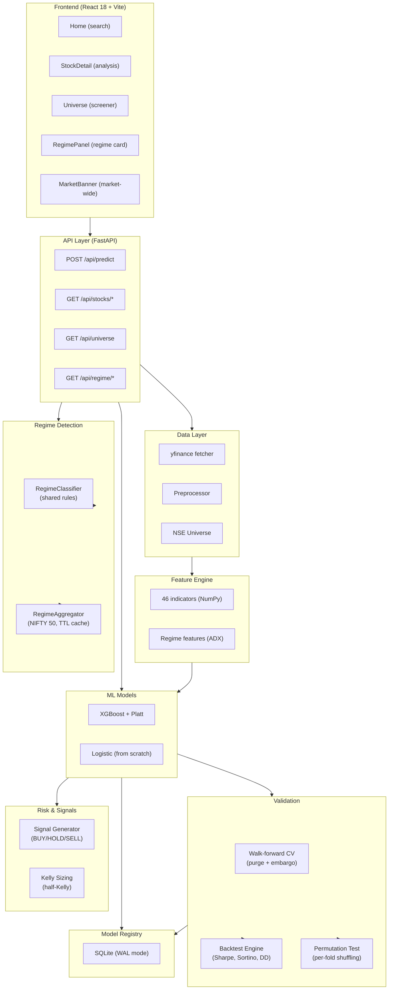

# Indicant

ML-powered long-term stock prediction for the Indian equity market. Input a ticker, get a calibrated BUY/HOLD/SELL signal with probability, feature importances, and risk metrics — backed by a full quantitative research pipeline built from first principles.


---

## Key Results

| Metric | Value |
|--------|-------|
| **Tests passing** | 208 |
| **Code coverage** | 92.43% |
| **NIFTY universe coverage** | 500/504 tickers (99.2%) |
| **Backtest — RELIANCE.NS** | Sharpe 0.19, Sortino 0.25, Max DD −25.2% |
| **Backtest — TCS.NS** | Sharpe 0.02, Sortino 0.04, Max DD −30.2% |
| **Backtest — HDFCBANK.NS** | Sharpe −0.45, Sortino −0.52, Max DD −25.6% |
| **Backtest — ADANIENT.NS** | Sharpe −0.05, Sortino −0.07, Max DD −47.1% |
| **Backtest — BAJFINANCE.NS** | Sharpe 0.44, Sortino 0.59, Max DD −36.3% |
| **Permutation test (200 perms, 5 NIFTY 50 constituents)** | None significant at p < 0.05. BAJFINANCE closest at p=0.0995. Strategy edge not distinguishable from randomly shuffled labels across all tested tickers. |
| **Historical spot-check — 2020 crash** | Bear + risk_off + high volatility correction drawdown (pinned to exact values) |
| **Historical spot-check — 2021 bull** | Bull + risk_on + peak drawdown (pinned) |
| **Historical spot-check — 2022 correction** | Bear + neutral (appropriately conservative — classifier doesn't false-alert risk_off) |

---

## What it does

You type `RELIANCE`. The system:

1. Fetches 5 years of OHLCV data from NSE via yfinance (cached as parquet)
2. Computes 46 technical indicators — all implemented from scratch in NumPy
3. Creates forward-looking binary labels (will price be higher in N months?)
4. Trains a walk-forward validated XGBoost model with Platt probability calibration
5. Predicts on the most recent data point and returns a structured signal
6. Detects market regime per-stock and market-wide (NIFTY 50 constituents)
7. Runs backtests with permutation-test significance validation

The result: a BUY/HOLD/SELL signal with a calibrated confidence score, the top feature drivers, a full technical indicator panel, and regime context — rendered in a React dashboard.

---

## Architecture



---

## Module Reference

Architecture details and full module API: [`docs/architecture.md`](docs/architecture.md)

### `backend/market_regime/`

| Module | Responsibility |
|--------|---------------|
| `data/` | OHLCV fetching, preprocessing, NSE universe management |
| `features/` | 46 technical indicators from scratch in NumPy |
| `models/` | XGBoost + Platt calibration, logistic regression from scratch |
| `validation/` | Purged walk-forward CV, label construction |
| `backtest/` | Walk-forward backtesting, metrics, permutation tests |
| `regime/` | Per-stock and market-wide regime detection (cache 15 min TTL) |
| `registry/` | SQLite model registry (experiment tracking) |
| `signals/` | BUY/HOLD/SELL signal generation |
| `risk/` | Half-Kelly position sizing |
| `api/` | FastAPI routes, schemas, middleware |
| `pipeline.py` | CLI orchestration (`indicant predict | backtest | screen`) |

---

## Project structure

```
indicant/
├── backend/
│   ├── market_regime/
│   │   ├── data/
│   │   │   ├── fetcher.py          # yfinance with retries, parquet cache, alias map
│   │   │   ├── universe.py         # NSE index universe (NIFTY 50/100/500)
│   │   │   └── preprocessor.py     # cleaning, log returns, outlier detection
│   │   ├── features/
│   │   │   └── technical.py        # 46 indicators from scratch in NumPy
│   │   ├── models/
│   │   │   ├── base.py             # abstract BaseModel interface
│   │   │   ├── logistic.py         # gradient descent from scratch
│   │   │   └── gradient_boost.py   # XGBoost + Platt calibration
│   │   ├── validation/
│   │   │   └── walk_forward.py     # purged walk-forward CV + label maker
│   │   ├── backtest/
│   │   │   ├── engine.py           # run_backtest() with walk-forward fold loop
│   │   │   ├── metrics.py          # Sharpe, Sortino, Max DD, CAGR, turnover
│   │   │   └── permutation_test.py # label-shuffling significance test
│   │   ├── regime/
│   │   │   ├── config.py           # all regime threshold constants
│   │   │   ├── classifier.py       # RegimeClassifier — shared rules
│   │   │   └── market.py           # RegimeAggregator with TTL cache
│   │   ├── registry/
│   │   │   ├── schema.sql          # DDL with permutation + evaluation_freq columns
│   │   │   └── model_registry.py   # SQLite-backed experiment tracking
│   │   ├── signals/
│   │   │   └── generator.py        # BUY/HOLD/SELL + ensemble voting
│   │   ├── risk/
│   │   │   └── sizing.py           # Kelly Criterion position sizing
│   │   ├── api/
│   │   │   ├── main.py             # FastAPI app, CORS, middleware, dotenv
│   │   │   ├── schemas.py          # Pydantic v2 request/response models
│   │   │   └── routes/
│   │   │       ├── prediction.py   # POST /api/predict — full ML pipeline
│   │   │       ├── stocks.py       # GET /api/stocks/search + /history
│   │   │       ├── regime.py       # GET /api/regime/{ticker} + /api/regime/market/summary
│   │   │       └── universe.py     # GET /api/universe — market screener
│   │   └── pipeline.py             # CLI orchestration (indicant predict/screen/backtest)
│   ├── tests/
│   │   ├── test_data.py            # 26 data layer tests
│   │   ├── test_features.py        # 17 feature engineering tests
│   │   ├── test_models.py          # 14 model tests (99% gradient_boost coverage)
│   │   ├── test_registry.py        # 27 model registry tests
│   │   ├── test_backtest.py        # 47 backtest engine tests
│   │   ├── test_permutation.py     # 11 permutation test tests
│   │   └── test_regime.py          # 36 regime detection tests (cache, spot-checks)
│   ├── Dockerfile
│   └── pyproject.toml
│
├── frontend/
│   ├── src/
│   │   ├── pages/
│   │   │   ├── Home.jsx            # search + feature overview
│   │   │   ├── StockDetail.jsx     # full analysis with RegimePanel integration
│   │   │   └── Universe.jsx        # market screener table
│   │   ├── components/
│   │   │   ├── PredictionCard.jsx  # signal, confidence meter, P(up), horizon
│   │   │   ├── PriceChart.jsx      # price + volume (Recharts ComposedChart)
│   │   │   ├── FeaturePanel.jsx    # 46 indicators in 4 sections with gauges
│   │   │   ├── RiskMetrics.jsx     # RSI, drawdown, volatility, 52W position
│   │   │   ├── RegimePanel.jsx     # regime badge, ADX gauge, sparkline
│   │   │   └── StockSearch.jsx     # debounced autocomplete against NSE universe
│   │   └── api/client.js           # axios with 120s timeout (ML pipeline time)
│   ├── nginx.conf                  # SPA routing + /api/ proxy to backend
│   ├── Dockerfile                  # multi-stage: node build → nginx serve
│   └── package.json
│
├── docs/
│   └── architecture.md             # Full architecture reference
│
├── .github/workflows/
│   ├── ci.yml                      # ruff lint + mypy + pytest (blocks merge)
│   ├── nightly.yml                 # Mon-Fri 6AM UTC drift detection
│   └── frontend.yml                # npm ci + vite build + artifact upload
│
└── docker-compose.yml              # backend + frontend + volumes + health checks
```

---

## Running locally

### Prerequisites

- Python 3.11+
- Node 20+
- Docker + Docker Compose (optional)

### Dev mode

```bash
# Terminal 1 — Backend
cd backend
python3 -m venv .venv && source .venv/bin/activate
pip install -e ".[dev]"
uvicorn market_regime.api.main:app --reload --port 8000

# Terminal 2 — Frontend
cd frontend
npm install
npm run dev
```

Open `http://localhost:5173`

### Docker (production)

```bash
cd frontend && npm install && cd ..   # generates package-lock.json
docker-compose up --build
```

Open `http://localhost`

---

## API

| Method | Endpoint | Description |
|--------|----------|-------------|
| `POST` | `/api/predict` | Full ML pipeline for a ticker |
| `GET` | `/api/stocks/search?q=RELIANCE` | Autocomplete search |
| `GET` | `/api/stocks/{ticker}/history` | OHLCV price history |
| `GET` | `/api/stocks/{ticker}/indicators` | Latest technical indicators |
| `GET` | `/api/universe?index=NIFTY50` | Ranked market screener |
| `GET` | `/api/regime/{ticker}` | Per-stock regime classification |
| `GET` | `/api/regime/market/summary` | Market-wide regime (NIFTY 50 constituents) |
| `GET` | `/health` | Health check |

Swagger UI at `http://localhost:8000/docs`

### Example — prediction

```bash
curl -X POST http://localhost:8000/api/predict \
  -H "Content-Type: application/json" \
  -d '{"ticker": "RELIANCE", "horizon_months": 6, "model": "gradient_boost"}'
```

```json
{
  "ticker": "RELIANCE.NS",
  "company_name": "Reliance Industries Ltd.",
  "signal": "BUY",
  "confidence": 0.6575,
  "probability_up": 0.6575,
  "horizon_months": 6,
  "current_price": 1321.2,
  "top_features": [
    {"feature": "volatility_atr_21", "importance": 41.35, "direction": "bullish"},
    {"feature": "trend_ema_50",      "importance": 38.24, "direction": "bullish"},
    {"feature": "momentum_roc_12m",  "importance": 36.24, "direction": "bearish"}
  ]
}
```

### Example — regime

```bash
curl http://localhost:8000/api/regime/RELIANCE
```

```json
{
  "ticker": "RELIANCE.NS",
  "primary_regime": "Bull",
  "regime_score": 0.72,
  "trend_direction": "uptrend",
  "volatility_regime": "normal",
  "drawdown_regime": "peak",
  "composite_signal": "risk_on",
  "adx": 28.3
}
```

---

## Tests

```bash
cd backend
source .venv/bin/activate
pytest tests/ -v --tb=short
```

```
208 passed in 3.42s
```

### Test breakdown

| Suite | Tests | Scope |
|-------|-------|-------|
| `test_data.py` | 26 | Fetcher, preprocessor, walk-forward split correctness |
| `test_features.py` | 17 | Indicator math, no-lookahead checks |
| `test_models.py` | 14 | Gradient boost (99% coverage), logistic regression |
| `test_registry.py` | 27 | SQLite model registry CRUD |
| `test_backtest.py` | 47 | Walk-forward backtest, metrics, edge cases |
| `test_permutation.py` | 11 | Label shuffling, p-value correction |
| `test_regime.py` | 36 | Classifier, market aggregator, cache, historical spot-checks |

---

## CLI

```bash
# Single stock prediction
indicant predict RELIANCE --horizon 6 --model gradient_boost

# Screen an index for top BUY signals
indicant screen --index NIFTY50 --horizon 6 --top 10

# Walk-forward backtest
indicant backtest RELIANCE --horizon 126 --eval-freq weekly
```

---

## ML Design — the parts that matter

ML design details are covered in [`docs/ml-design.md`](docs/ml-design.md) (forthcoming). Key principles:

- **Walk-forward validation** with purge + embargo periods prevents future leakage
- **46 technical indicators** from scratch in NumPy — auditable, not a black box
- **XGBoost + Platt calibration** for well-calibrated probabilities
- **Per-stock + market-wide regime detection** with shared `RegimeClassifier` rules
- **Permutation test** (per-fold label shuffling) provides honest significance assessment
- **Half-Kelly position sizing** with volatility scaling

---

## Tech stack

| Layer | Technology |
|-------|------------|
| Data | yfinance, pandas, NumPy, pyarrow |
| ML | XGBoost, scikit-learn, SciPy |
| Experiment tracking | SQLite Model Registry (custom) |
| API | FastAPI, Pydantic v2, Uvicorn |
| Frontend | React 18, Vite, Tailwind CSS v3, Recharts, Zustand, Axios |
| DevOps | Docker, nginx, GitHub Actions, Ruff, Mypy, Pytest |

---

## What I implemented from scratch

- **Sigmoid function** with numerical stability for large negative inputs
- **Binary cross-entropy loss** with L2 regularisation
- **Gradient descent** with mini-batch support, early stopping, Xavier initialisation
- **SMA, EMA** (with `adjust=False` to match TradingView behaviour)
- **Wilder's Moving Average (RMA)** used by RSI and ATR
- **RSI** with correct gain/loss separation and edge case handling (all gains → RSI=100)
- **Stochastic Oscillator** %K and %D
- **MACD** line, signal, histogram
- **Bollinger Bands** with %B and bandwidth
- **True Range** and **ATR** accounting for overnight gaps
- **OBV** with sign-based volume accumulation
- **Rolling VWAP** using typical price weighting
- **ADX** with +DI/-DI directional movement computation
- **Realised volatility** annualised with √252
- **Purged walk-forward cross-validator** with configurable purge and embargo periods
- **Forward-looking label construction** with NaN handling
- **Kelly Criterion** with half-Kelly and volatility scaling
- **Platt scaling** (logistic regression on held-out scores for calibration)
- **Model Registry** (SQLite, WAL mode, JSON hyperparams)
- **Backtest Engine** (walk-forward, transaction costs, permutation testing)
- **Regime Detection** (per-stock + market-wide, shared classifier, TTL cache)

---

## Author

**Manav Garg**
