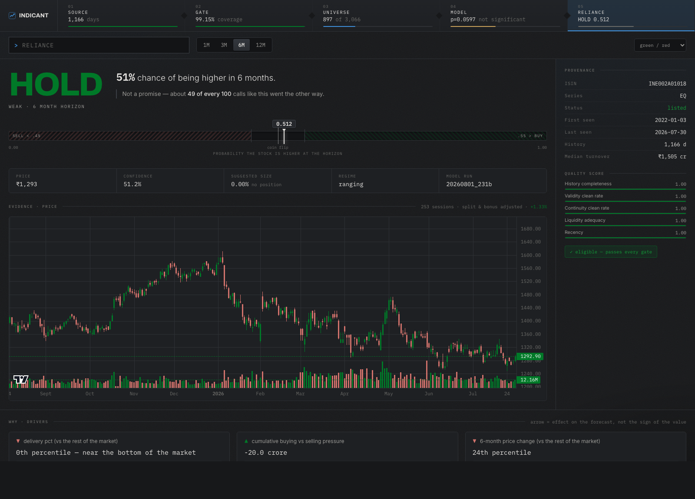
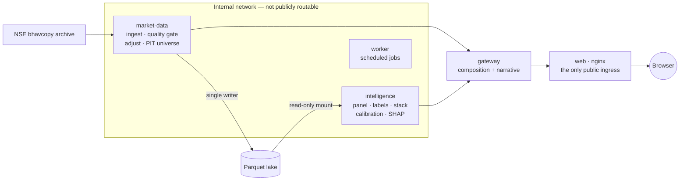
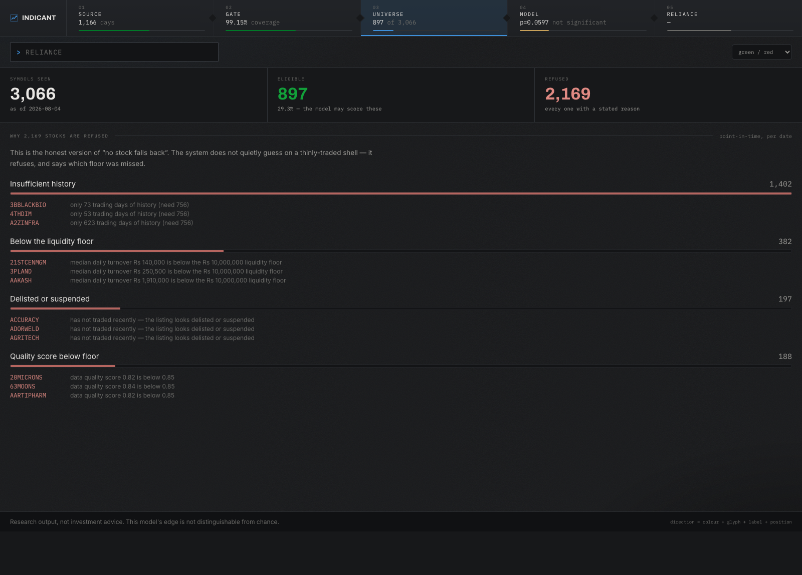
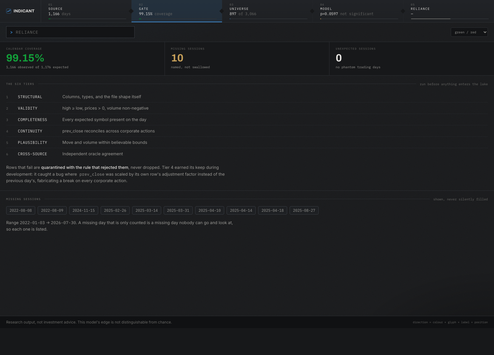

<div align="center">

# Indicant

**A machine-learning prediction system for Indian (NSE) equities that reports how often it is wrong.**

Type a ticker. Get a calibrated probability, the drivers behind it, and — on every
screen — whether the model's edge is distinguishable from chance.

It currently is not. That is the most important thing on the page.

[](https://github.com/manav363/indicant/actions/workflows/ci.yml)


</div>



---

## Table of contents

- [The result, stated honestly](#the-result-stated-honestly)
- [What makes this different](#what-makes-this-different)
- [Architecture](#architecture)
- [The data](#the-data)
- [The model](#the-model)
- [The interface](#the-interface)
- [Running it](#running-it)
- [Testing and CI](#testing-and-ci)
- [Project layout](#project-layout)
- [Engineering decisions worth knowing](#engineering-decisions-worth-knowing)
- [Limitations and next steps](#limitations-and-next-steps)

---

## The result, stated honestly

Trained on the real lake described below. These are the actual numbers from run
`20260801_231b`, not targets:

| Metric | Value | What it means |
|---|---|---|
| ROC AUC | **0.5470** | Barely above a coin flip — which is normal for this problem |
| ElasticNet baseline AUC | 0.5256 | The stack beats a linear baseline by **+0.0214** |
| Brier skill score | +0.0027 | Calibration marginally better than the base rate |
| **Permutation test** | **p = 0.0597** (200 shuffles) | **NOT significant at α = 0.05** |

Across 200 runs on **shuffled labels**, about 12 did as well as the real model.
The edge is real enough to beat a linear baseline and not strong enough to rule
out luck.

For context, Gu, Kelly and Xiu found that sub-1% monthly R² is state of the art
in empirical asset pricing. An AUC of 0.547 lives in roughly that world — the
honest framing is "a weak signal, measured carefully," not "a broken model."

**Two design consequences follow, and they are enforced in code:**

1. With no trained model, every prediction endpoint returns **503** — never a
   neutral `0.5`. A 0.5 would reach the narrative layer and be rendered as a
   genuine call about a real company.
2. A symbol the model cannot score is **absent** from the screener rather than
   present with a placeholder.

The p-value sits in the status rail of every screen, and the footer says the
edge is not distinguishable from chance whenever that is true.

---

## What makes this different

Most stock-prediction projects show a chart and a BUY badge. The distinguishing
work here is everything *behind* that badge — and the UI is built so you can
walk backwards through it.

| | |
|---|---|
| 🏛 **Exchange-native data** | Reads the NSE's own end-of-day **bhavcopy** archive, not a third-party API. Two format eras handled: the legacy layout and the UDiFF layout NSE cut over to on 2024-07-08. |
| 🕰 **No survivorship bias** | The universe is rebuilt **point-in-time** from what was actually trading on each date. 1,731 delisted names are retained. |
| 🛡 **A six-tier quality gate** | Every row is judged before entering the lake. Failures are **quarantined with the rule that rejected them**, never silently dropped. |
| 🔍 **Auditable refusals** | 3,066 symbols → 897 eligible. Each of the 2,169 refusals states which floor it missed. |
| 📉 **Published uncertainty** | The permutation p-value is on every screen, not buried in a notebook. |
| 🧾 **Provenance per symbol** | ISIN, series, listing lineage and a five-component quality score sit beside every prediction. |

---

## Architecture

Five services. The **provenance chain** is both the data flow and the app's
primary navigation — every stage is a screen you can open.

```
   ① SOURCE  ──▸  ② GATE  ──▸  ③ UNIVERSE  ──▸  ④ MODEL  ──▸  ⑤ CALL
   bhavcopy       6 tiers      point-in-time     stacked      probability
   1,166 days     99.15%       897 / 3,066       p=0.0597     + drivers
```



**Two planes, deliberately separated:**

- **Control plane (HTTP)** — small questions: what is the universe, is this
  symbol eligible, what did the gate say.
- **Data plane (shared parquet)** — `intelligence` reads parquet paths directly.
  Moving a million training rows as JSON is minutes of serialization for zero
  benefit.

`market-data` mounts the lake read-write; `intelligence` mounts it **read-only**.
That boundary is enforced by the Docker mount, not by a code review comment.

### API surface

29 routes across four services. Only the gateway is public; nginx returns 404
for `/internal/`.

| Endpoint | Purpose |
|---|---|
| `GET /api/chain` | All five pipeline stages in one call — the rail is on every screen |
| `GET /api/stock/{symbol}` | The whole call screen: candles, prediction, drivers, regime |
| `GET /api/provenance/{symbol}` | ISIN, series, listing lineage, five quality components |
| `GET /api/gate` | Calendar coverage and the six tiers |
| `GET /api/universe/detail` | Eligible vs refused, grouped by reason |
| `GET /api/model` | The model card — p-value, features, significance |
| `GET /api/search` | Type-ahead over the **eligible** universe, with reasons for near-misses |
| `GET /api/screen` | Ranked table over the training universe |

---

## The data

Built by walking the NSE bhavcopy archive.

| | |
|---|---|
| Rows | **3,152,890** |
| Symbols seen | 5,885 |
| Trading days | 1,166 |
| Range | 2022-01-03 → 2026-07-30 |
| Corporate actions | 9,925 (668 price-affecting) |
| Calendar coverage | **99.15%** — 10 missing sessions, each named |
| Eligible universe | **897** of 3,066 |
| Delisted names retained | **1,731** |

### Why the delisted names matter

Screening today's listed companies and backtesting them through 2022 silently
asks *"how did the survivors do?"* — and the answer is always flattering. The
universe here is rebuilt per date from what was actually trading then.

### A sanity check that validated the whole pipeline

Reconstructed from raw bhavcopy, with nothing in the code aware of it:

| Symbol | 2022 return |
|---|---|
| INFY | −20.6% |
| TCS | −14.7% |
| RELIANCE | +6.0% |
| HDFCBANK | +7.1% |

That is the actual 2022 Indian IT selloff, recovered from first principles.

### The six-tier quality gate

| Tier | Checks |
|---|---|
| 1 · Structural | Columns, types, and the file shape itself |
| 2 · Validity | `high ≥ low`, prices > 0, volume non-negative |
| 3 · Completeness | Every expected symbol present on the day |
| 4 · Continuity | `prev_close` reconciles across corporate actions |
| 5 · Plausibility | Move and volume within believable bounds |
| 6 · Cross-source | Independent oracle agreement |

Tier 4 earned its keep during development: it caught a bug where `prev_close`
was being scaled by its *own* row's adjustment factor instead of the previous
day's, fabricating a continuity break on every corporate action.

### Why 2,169 symbols are refused

This is the honest version of "no stock falls back" — the system does not
quietly guess on a thinly-traded shell.

| Reason | Count |
|---|---|
| Insufficient history (< 756 sessions) | 1,402 |
| Below the ₹1 crore liquidity floor | 382 |
| Delisted or suspended | 197 |
| Quality score below 0.85 | 188 |

---

## The model

| Layer | What |
|---|---|
| **L0** | Pooled cross-sectional panel — 94 features including `_xs` market ranks |
| **L1** | Triple-barrier labelling (López de Prado) + average-uniqueness sample weights |
| **L2** | Heterogeneous base learners (XGBoost, LightGBM, forest, shallow MLP, ElasticNet baseline) |
| **L3** | Stacking meta-learner over purged/embargoed out-of-fold predictions |
| **L5** | Meta-labelling — implemented, not trained in the current run |
| **L6** | Platt calibration |

**Validation is purged + embargoed CV split by *date*, not by row.** Splitting a
panel by row leaks tomorrow's cross-section into today's fold. Also implemented:
combinatorial purged CV (CPCV), the Deflated Sharpe Ratio, and a permutation
test with per-fold and within-date shuffling.

**Cross-sectional features are rebuilt at serve time.** A model trained on a
30-symbol cross-section cannot score one symbol in isolation — the `_xs`
features would come out missing, and filling them with zeros would hand the
model a market in which every stock is exactly average. The training universe is
recorded in the artifact so serving reproduces it exactly.

---

## The interface

<table>
<tr>
<td width="50%"></td>
<td width="50%"></td>
</tr>
<tr>
<td align="center"><b>③ Universe</b> — every refusal, with its reason</td>
<td align="center"><b>② Gate</b> — coverage and the six tiers</td>
</tr>
</table>

### Direction is never carried by colour alone

The palette is computed, not chosen. Measured against this surface with the
CVD validator:

| Pair | CVD ΔE | Verdict |
|---|---|---|
| The obvious terminal green/red | 3.8 | ❌ below the ΔE 6 floor |
| GitHub's own dark-mode pair | 3.5 | ❌ below the floor |
| **Shipped `#007928` / `#d2736c`** | **9.7** | ✅ |

Under deuteranopia the first two are effectively one colour — and most trading
screens ship something in that range. Every directional element also carries a
**glyph, a text label and a position**, and a **monochrome palette ships as a
setting** so the claim stays continuously falsifiable rather than asserted.

### Plain language is a separate layer

`intelligence` emits structured facts with numbers; `gateway` turns facts into
English. Copy changes without redeploying a model, the narrative is unit-testable
with no model in the loop, and a wording change cannot silently move a number.

Probabilities are never stated bare — not *"66% chance"* but
*"66%, and about 34 of every 100 calls like this went the other way."*

---

## Running it

**Requirements:** Docker and Docker Compose. Nothing else.

```bash
git clone https://github.com/manav363/indicant.git
cd indicant/infra
docker compose up -d --build
```

Then open **<http://localhost:8080>**.

The compose file bind-mounts `data/lake`, so the stack comes up on a real lake
and trained model if you have them. A named volume would start empty, and an
empty lake means a terminal that honestly reports *"no lake / untrained"* —
running, but useless as a demo.

Only `web` is published. `gateway`, `market-data` and `intelligence` are
reachable solely on the internal network.

### Building a lake from scratch

```bash
# 1 — Ingest a date range from the NSE bhavcopy archive (resumable)
indicant-md backfill --from 2022-01-01 --to 2026-07-30

# 2 — Load corporate actions, then write the back-adjusted dataset.
#     `adjust` refuses to run on zero actions rather than emitting an
#     "adjusted" dataset identical to raw while claiming splits were handled.
indicant-md actions --file corp_actions.csv
indicant-md adjust --from 2022-01-01

# 3 — Build the point-in-time universe for a date
indicant-md universe --as-of 2026-07-30

# 4 — Train: panel → labels → stack → validation
indicant-ml train --from 2022-01-01 --symbols 30 --permutations 200

# Inspect at any point
indicant-md status        # lake state, coverage, quarantine
indicant-ml status        # current model and its p-value
```

Every subcommand exits non-zero on a real problem, so a scheduled run fails
loudly rather than logging a warning nobody reads.

### Local development

```bash
cd web && npm install && npm run dev     # proxies /api to nginx on :8080
```

---

## Testing and CI

```bash
pytest packages services --no-cov -q     # 633 tests
cd web && npm test                       # 12 tests
```

| Package | Tests |
|---|---|
| `packages/contracts` | 49 |
| `services/market-data` | 165 |
| `services/intelligence` | 323 |
| `services/gateway` | 83 |
| `services/worker` | 13 |
| `web` | 12 |

CI runs lint, tests, a service-import check, all Docker builds, and a
**security-header guard** that boots nginx and asserts the CSP is present on
every response — a regression test for a real bug where `add_header` in a
`location` block silently dropped every inherited security header.

Ruff's first-party detection is pinned via `src = ["src", "tests"]` so lint
results do not depend on whether packages happen to be installed.

---

## Project layout

```
indicant/
├── packages/
│   └── contracts/          Shared Pydantic schemas + a schema-freeze snapshot
├── services/
│   ├── market-data/        Ingest · quality gate · adjustment · PIT universe
│   │                       SINGLE WRITER to the lake
│   ├── intelligence/       Panel · labels · stack · validation · serving
│   │                       READ-ONLY lake access
│   ├── gateway/            Composition + plain-language narrative — public
│   └── worker/             Scheduled jobs (off by default)
├── web/                    React 18 + TypeScript terminal
├── infra/                  docker-compose.yml · nginx.conf · security headers
├── data/lake/              Parquet — gitignored
└── docs/assets/            Screenshots
```

---

## Engineering decisions worth knowing

<details>
<summary><b>Why refuse rather than guess</b></summary>

An untrained model returns 503, not 0.5. An ineligible symbol is absent from
the screener, not present with a placeholder. A missing feature returns `None`,
not a default — a `.get(key, 0.0)` on a misspelled feature name once made every
trending stock silently report BEAR, with nothing raised and no test failing.
Feature names crossing that boundary are now pinned by a test against a real
panel.
</details>

<details>
<summary><b>Why the gateway owns the prose</b></summary>

`intelligence` emits `ExplanationFact` objects containing numbers and labels —
never sentences. The gateway renders English. This means user-facing wording
changes without redeploying a model, the copy is unit-testable against fixed
facts with no model in the loop, and a copy change cannot alter a figure.
</details>

<details>
<summary><b>Why one composed request per screen</b></summary>

The gateway fans out to both upstreams in parallel, so page latency is the
**max** of the upstream calls rather than their sum. Stitching in the browser
would also multiply the loading states. The provenance rail appears on every
screen, so its five stages arrive in a single `/api/chain` call.
</details>

<details>
<summary><b>Why cross-sectional serving is cached</b></summary>

Serving one symbol requires rebuilding the whole universe's feature panel. The
screener called predict per symbol, so ranking 30 stocks built the identical
30-symbol panel 30 times — 23.1s for market breadth. Memoised per trading day,
with a warm-up at startup so the first visitor of the day does not pay for it
either: **15.8s → 0.06s**.
</details>

<details>
<summary><b>Why the fonts are self-hosted</b></summary>

nginx ships `font-src 'self'`, and its own comment says the frontend bundles
everything so the CSP can stay strict. Google Fonts would have meant widening
the policy on the one service facing the internet.
</details>

---

## Limitations and next steps

**Stated plainly, because the project's whole argument is that it reports what
it cannot do.**

| Limitation | Detail |
|---|---|
| **Not statistically significant** | p = 0.0597 over 200 shuffles. The edge beats a linear baseline but cannot be separated from luck. |
| **Backfill is 4.5 years, not 20** | The lake covers 2022→2026. Extending it is the single highest-leverage remaining move — roughly 4× more data against a p-value already close to the line, using an ingest path that is already written and tested. |
| **Training universe is 30 symbols** | Cross-sectional serving must reproduce the training cross-section, which currently caps the screener. |
| **L5 meta-labelling is untrained** | Implemented and tested; not fitted in the current run. |
| **Cross-source tier is inactive** | Tier 6 needs a second independent price source. |

---

<div align="center">

**Research output, not investment advice.**
By its own permutation test, this model does not yet demonstrate an edge.

</div>
